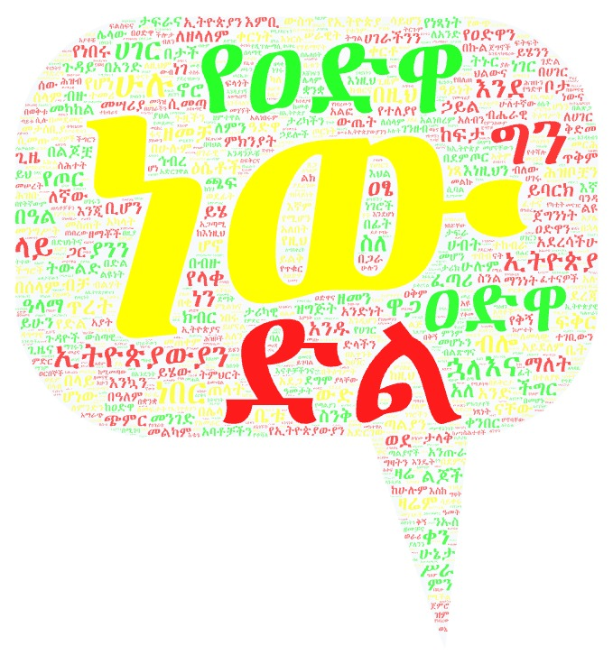

# PM Abiy Ahmed Ali's Battle of Adwa Victory Day Messages

This repo contains the messages that Abiy Ahmed Ali, the Prime Minister of Ethiopia, shared on the occasion of [the Battle of Adwa](https://en.wikipedia.org/wiki/Battle_of_Adwa) Victory Day, celebrated on **የካቲት 23** (March
1st or 2nd) every year.

## Victory Messages
| Nth | Date | Links | Message Content |
|---------|------------|-------|----------------|
| 129 | Mar 1, 2025 | [Twitter](https://x.com/AbiyAhmedAli/status/1895745053060173824) | [Adwa_129.pdf](./docs/pdf/Adwa_129.pdf) \| [Adwa_129.md](./docs/text/Adwa_129.md) |
| 128 | Mar 1, 2024 | [PMO](https://www.pmo.gov.et/media/documents/Adwa_1281.pdf), [Twitter](https://x.com/AbiyAhmedAli/status/1763566399203491856), [Facebook](https://www.facebook.com/PMAbiyAhmedAli/posts/pfbid0iAXTUdoSnKzX78gRmuH8yTfXPZzNqEZLGKcwpEQZBZEEA1Csp7etsDrQwnzpz3VYl) | [Adwa_128.pdf](./docs/pdf/Adwa_128.pdf) \| [Adwa_128.md](./docs/text/Adwa_128.md) |
| 127 | Mar 1, 2023 | [Twitter](https://x.com/AbiyAhmedAli/status/1630849375957139457), [Facebook](https://www.facebook.com/profile/100044183688553/search/?q=%E1%8B%A8%E1%8B%90%E1%8B%B5%E1%8B%8B%20%E1%8B%B5%E1%88%8D) | [Adwa_127.pdf](./docs/pdf/Adwa_127.pdf) \| [Adwa_127.md](./docs/text/Adwa_127.md) |
| 126 | Mar 1, 2022 | [Twitter](https://twitter.com/AbiyAhmedAli/status/1498656532472512521), [PMO](https://www.pmo.gov.et/media/documents/PM_Message_Adwa2014.pdf) | [Adwa_126.pdf](./docs/pdf/Adwa_126.pdf) \| [Adwa_126.md](./docs/text/Adwa_126.md) |
| 125 | Mar 1, 2021 | [Twitter](https://twitter.com/AbiyAhmedAli/status/1366281994116677632), [Facebook](https://www.facebook.com/permalink.php?story_fbid=477523916995610&id=112704996810839) | [Adwa_125.pdf](./docs/pdf/Adwa_125.pdf) \| [Adwa_125.md](./docs/text/Adwa_125.md) |
| 124 | Mar 2, 2020 | [Twitter](https://twitter.com/AbiyAhmedAli/status/1234392251368984578), [Facebook](https://www.facebook.com/permalink.php?story_fbid=192725205475484&id=112704996810839), [PMO](https://www.pmo.gov.et/media/documents/%E1%8C%A0%E1%89%85%E1%88%8B%E1%8B%AD_%E1%88%9A%E1%8A%92%E1%88%B5%E1%89%B5%E1%88%AD__%E1%8B%A8%E1%8B%90%E1%8B%B5%E1%8B%8B_%E1%8B%B5%E1%88%8D_%E1%88%98%E1%89%B3%E1%88%B0%E1%89%A2%E1%8B%AB_%E1%89%A0%E1%8B%93%E1%88%8D%E1%8A%95_%E1%89%A0%E1%89%B0%E1%88%98%E1%88%88%E1%8A%A8%E1%89%B0_%E1%88%88%E1%88%98%E1%88%8B%E1%8B%8D_%E1%8B%A8%E1%8A%A2%E1%89%B5%E1%8B%AE%E1%8C%B5%E1%8B%AB_%E1%88%95%E1%8B%9D%E1%89%A5_%E1%8B%AB%E1%88%B5%E1%89%B0%E1%88%8B%E1%88%88%E1%8D%89%E1%89%B5_%E1%88%98%E1%88%8D%E1%8A%A5%E1%8A%AD%E1%89%B5_.pdf) | [Adwa_124.pdf](./docs/pdf/Adwa_124.pdf) \| [Adwa_124.md](./docs/text/Adwa_124.md) |
| 123 | Mar 1, 2019 | [PMO-Facebook](https://www.facebook.com/PMOEthiopia/posts/pfbid0kxp4KoLYLVbH1hxiwv2jfAXkmx1SnGf49wjMWG8fuevmg2Si1Z6tv7B7fRSvBsPLl), [PMO 365-369](https://www.pmo.gov.et/media/other/megabit_to_megabit2011.pdf) | [Adwa_123.pdf](./docs/pdf/Adwa_123.pdf) \| [Adwa_123.md](./docs/text/Adwa_123.md) |

## Additional

- See [docs/pdf](./docs/pdf/) for the original messages, and [docs/text](./docs/text/) for the texts.

- The PM's Social Media Handles

  - [Twitter](https://twitter.com/AbiyAhmedAli)
  - [Facebook](https://www.facebook.com/PMAbiyAhmedAli)
  - [Telegram](https://t.me/s/AbiyAhmedAliofficial)

- [የአዲስ አበባ ከተማ አስተዳደር የአድዋ ድልን የሚዘክር ማዕከል ሊገነባ ነው](https://www.facebook.com/fanabroadcasting/posts/2210808852343175)
